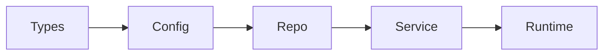

# 架构与分层（Architecture）

> 单源真相：本仓库内架构与依赖方向的权威描述。Agent 实现时必须遵守此分层。

---

## 一、分层模型

后端采用固定分层，依赖方向**仅允许从左到右**（下层不可依赖上层）：

```
Types → Config → Repo → Service → Runtime
  ↑
Providers（跨域入口，若存在）
```

| 层 | 包路径 | 职责 | 可依赖 |
|----|--------|------|--------|
| **Types** | `com.harness.kata.types` | 领域类型、DTO、值对象 | 无（最底层） |
| **Config** | `com.harness.kata.config` | 配置、环境、特性开关 | Types |
| **Repo** | `com.harness.kata.repo` | 数据访问（持久化、查询） | Types, Config |
| **Service** | `com.harness.kata.service` | 业务逻辑、用例编排 | Types, Config, Repo |
| **Runtime** | `com.harness.kata.runtime` | HTTP API、Controller、请求/响应映射 | Types, Config, Service |

**禁止**：Runtime 不得直接依赖 Repo；Service 不得依赖 Runtime。

---

## 二、分层依赖图（Mermaid）



---

## 三、前后端边界

- **后端**：`backend/`，Spring Boot，暴露 REST API；端口默认 8080。
- **前端**：`frontend/`，React + Vite，仅通过 HTTP 调用后端 API，不直连数据库。
- **契约**：API 契约见 [API-CONTRACT.md](API-CONTRACT.md)（或 `openspec/specs/` 中能力规格）；实现与契约须一致。

---

## 四、校验方式

- **ArchUnit**：在 CI 与本地测试中运行分层规则，禁止违反依赖方向。
- **新增包/类**：必须落在上述某一层内，且仅引用允许的层。

---

## 五、参考

- [IMPLEMENTATION-GUIDE.md](IMPLEMENTATION-GUIDE.md) 第四节项目结构、第七节架构约束。
- [PROJECT-PURPOSE.md](PROJECT-PURPOSE.md) 示例项目定位与 Harness 设计要点。
